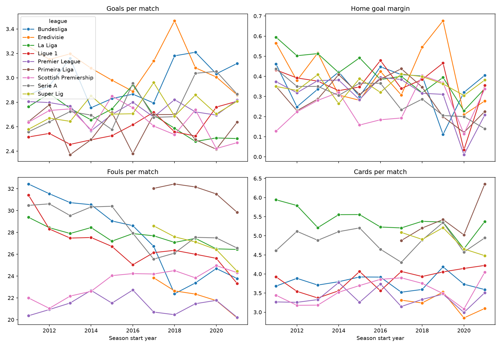
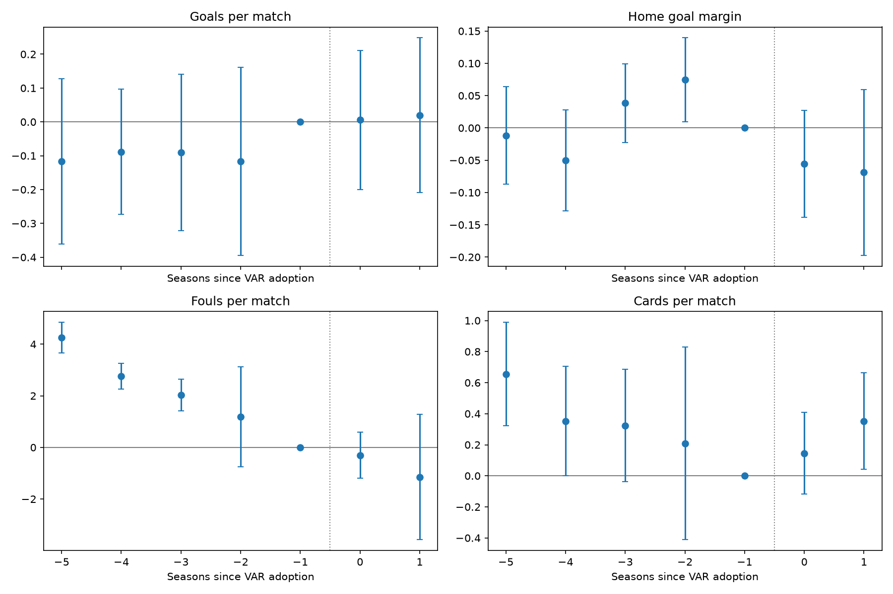

```{python}
#| include: false
import duckdb
import numpy as np
import pandas as pd
import matplotlib.pyplot as plt

con = duckdb.connect("data/processed/var.duckdb", read_only=True)
```

::: {.callout-note}
## Summary

This project starts from a deliberately broad question, did video assistant referees (VAR) change how soccer is played, and shows how to turn it into a precise question that data can answer. Leagues adopted VAR in different seasons, so the rollout works as a natural experiment. Using about 32,000 matches from nine European leagues, I compared adopting leagues with leagues that had not yet adopted, checked that the comparison was fair before trusting it, and measured uncertainty in a way that is honest about having only nine leagues.

The finding is that goals per match, the home team's advantage, and cards show no detectable change after VAR. Fouls appear to fall by about 2.8 per match, but the adopting leagues were already drifting down relative to the comparison leagues for years before VAR arrived, so the drop is not credited to VAR. The design can rule out large effects but not moderate ones.

The soccer topic is incidental. The same method answers whether a feature launch, a price change, or a new regulation moved a metric when nobody ran a randomized experiment, and the later sections spell out how the pieces carry over.
:::

# The question, and why it is harder than it looks

"Does VAR change soccer?" sounds like a single question, but it hides several decisions. Change what, exactly? Compared with what? Over what period? For which leagues? Before any analysis can start, the question has to be made precise. The version used here is the following.

> For a league that adopts VAR, how did its average goals, home goal margin, fouls, and cards per match in the adoption season and the season after differ from what they would have been without VAR?

The phrase "would have been without VAR" is what makes this a causal question and not a descriptive one. A league is either playing with VAR or without it in a given season, never both, so the outcome that would have happened in the other case is never observed. This is often called the fundamental problem of causal inference. Every method in this report is a way of building a believable stand in for that missing outcome, which is called the counterfactual, and of being honest about how much trust the stand in deserves.

It also helps to say what this is not. It is not a prediction problem, where the goal is to forecast the next match. A model that predicts goals very well can say nothing about whether VAR changed them. The task is to estimate the effect of an intervention, and that calls for a different toolkit built around comparison groups, assumptions that can be checked, and careful uncertainty.

# Data and outcomes

The data are match results from football-data.co.uk, a source that publishes one CSV file per league and season. The sample covers nine leagues across the 2011 to 2012 through 2021 to 2022 seasons. The table shows each league's first season with VAR in every match, the number of matches, and how much fouls and cards data is missing.

```{python}
#| output: asis
tbl = con.execute("""
SELECT league AS League,
       CASE WHEN var_start > 2021 THEN 'After 2021 to 2022 (comparison only)'
            ELSE CAST(var_start AS VARCHAR) || ' to ' || CAST(var_start + 1 AS VARCHAR) END AS "First VAR season",
       COUNT(*) AS Matches,
       CAST(ROUND(100.0 * SUM(CASE WHEN fouls IS NULL THEN 1 ELSE 0 END) / COUNT(*), 0) AS INTEGER) AS "Fouls and cards missing (%)"
FROM matches
GROUP BY league, var_start
ORDER BY var_start, league
""").df()
print(tbl.to_markdown(index=False))
```

Four outcomes are studied. Each is built from the raw match columns, and each answers a different version of the question about how the game is played.

| Outcome | How it is built | What it captures |
|:--|:--|:--|
| Goals per match | Home goals plus away goals | Overall scoring and the flow of play |
| Home goal margin | Home goals minus away goals | Home advantage, including possible referee bias toward the home side |
| Fouls per match | Home fouls plus away fouls | How physically the game is played and whistled |
| Cards per match | Yellow and red cards for both teams | Disciplinary strictness |

For scale, here are the average values across the whole sample.

```{python}
#| output: asis
lv = con.execute("""
SELECT ROUND(AVG(total_goals), 2) AS "Goals",
       ROUND(AVG(home_margin), 2) AS "Home goal margin",
       ROUND(AVG(fouls), 1) AS "Fouls",
       ROUND(AVG(cards), 1) AS "Cards"
FROM matches
""").df()
print(lv.to_markdown(index=False))
```

Several data decisions shaped what can be concluded, and each was made deliberately.

**Which leagues.** Belgium and Greece were excluded even though football-data.co.uk covers them. Belgium rolled VAR out gradually, with testing in only a small number of matches before wider use, and Greece had repeated delays and an unclear start. Coding either as a clean switch from untreated to treated would put noise into the one variable the whole analysis depends on, so a smaller and cleaner sample was preferred.

**What counts as treated.** A league is treated from the first season in which VAR was used in its league matches, taken from public sources. Scotland adopted VAR in October 2022, after the data ends, so it is never treated here and serves as a pure comparison league.

**Missing fouls and cards.** About half of the matches in the Eredivisie, Primeira Liga, and Super Lig have no fouls or cards recorded. Rather than guess values, those three leagues are used for goals and home margin only, and the fouls and cards results rest on the remaining six leagues.

**Short seasons.** The 2019 to 2020 seasons were cut short in several leagues, which is why a few league seasons have fewer matches. They are kept as played.

**Pipeline and checks.** Raw files are downloaded, stacked into one table, cleaned, and loaded into a DuckDB database that the analysis queries with SQL. Automated tests confirm that the treatment variable switches on in the correct season for every league.

# Why simple comparisons mislead

Two simple comparisons come to mind first, and both fail here. The first compares each league before and after it adopted VAR. The problem is that outcomes change over time for reasons that have nothing to do with VAR, such as rule emphasis, tactics, or a pandemic, and a before and after comparison credits all of that change to VAR. The second compares leagues that have VAR with leagues that do not at a single point in time. The problem is that leagues differ permanently. The Premier League, for example, whistles far fewer fouls than Serie A in every season, so a gap in levels says nothing about VAR.

The raw trends make both problems concrete.



Two features of the figure matter for the design. Levels differ a lot between leagues, so the method must compare each league with itself over time. And the trends move around, with some leagues sliding steadily, so the method must also separate VAR from whatever else is moving every league at the same time. Difference in differences does both.

# Difference in differences

## The core idea

Take one group of leagues that adopted VAR and one group that had not. Measure how much the outcome changed in each group between a period before adoption and a period after it. The adopting group's change contains two things, the effect of VAR and whatever would have changed anyway. The comparison group's change contains only the second thing. Subtracting one from the other removes the part that is common to both, which leaves the effect of VAR.

$$
\hat{\beta}_{DiD} = \left(\bar{y}_{T,post} - \bar{y}_{T,pre}\right) - \left(\bar{y}_{C,post} - \bar{y}_{C,pre}\right)
$$

Here the letter T marks the adopting leagues and C marks the comparison leagues. Each term is an average outcome, either before or after adoption. The first bracket is the change in adopting leagues and the second is the change in comparison leagues, so the formula is literally a difference of two differences.

```{python}
#| label: fig-did-idea
#| fig-cap: "Illustration with made up numbers. The dashed line shows what the adopting group would have done without VAR, and the arrow is the estimated effect."
t = np.arange(-4, 3)
comp = 10 + 0.5 * t
treat_cf = 12 + 0.5 * t
effect = -1.5
treat = treat_cf + np.where(t >= 0, effect, 0)

fig, ax = plt.subplots(figsize=(7, 4))
ax.plot(t, comp, marker="o", label="Comparison leagues")
ax.plot(t, treat, marker="o", label="Adopting leagues")
ax.plot(t[t >= -1], treat_cf[t >= -1], ls="--", color="grey", label="Adopting leagues without VAR (counterfactual)")
ax.axvline(-0.5, color="grey", lw=1, ls=":")
ax.annotate("", xy=(1, treat[t == 1][0]), xytext=(1, treat_cf[t == 1][0]),
            arrowprops=dict(arrowstyle="<->"))
ax.text(1.1, (treat[t == 1][0] + treat_cf[t == 1][0]) / 2, "effect", va="center")
ax.set_xlabel("Seasons relative to adoption")
ax.set_ylabel("Outcome (illustrative)")
ax.legend(fontsize=8)
fig.tight_layout()
plt.show()
```

## The assumption everything rests on

The subtraction only works if the adopting leagues would have followed the same trend as the comparison leagues had VAR never arrived. This is the parallel trends assumption. It does not require the leagues to have the same levels, only the same direction and pace of change.

$$
E\left[\,y_{lt}(0) - y_{l,t-1}(0) \mid l \in T\,\right] = E\left[\,y_{lt}(0) - y_{l,t-1}(0) \mid l \in C\,\right]
$$

In words, the expected change in the no VAR outcome, written y of zero, is the same for adopting and comparison leagues. The assumption concerns outcomes that are never observed after adoption, so it can never be proven. What can be done is to check whether the two groups moved together before adoption, and that check is the event study later in this report.

## A worked example from the data

To make the formula concrete, here is the simplest version computed on real data, using goals per match. The adopting group is the three leagues that adopted in 2017 to 2018, and the comparison group is the leagues that had not adopted by the end of the following season. The before period is the five seasons before adoption and the after period is the adoption season plus one more.

```{python}
#| output: asis
d = con.execute("SELECT league, season_start, var_start, total_goals FROM matches").df()
treated = d[d["var_start"] == 2017]
controls = d[d["var_start"] > 2018]

def avg(df, lo, hi):
    return df[(df["season_start"] >= lo) & (df["season_start"] <= hi)]["total_goals"].mean()

t_pre, t_post = avg(treated, 2012, 2016), avg(treated, 2017, 2018)
c_pre, c_post = avg(controls, 2012, 2016), avg(controls, 2017, 2018)

ex = pd.DataFrame({
    "Group": ["Adopting leagues (Bundesliga, Serie A, Primeira Liga)",
              "Comparison leagues (Premier League, Scottish Premiership)",
              "Difference in differences"],
    "Before": [round(t_pre, 3), round(c_pre, 3), ""],
    "After": [round(t_post, 3), round(c_post, 3), ""],
    "Change": [round(t_post - t_pre, 3), round(c_post - c_pre, 3),
               round((t_post - t_pre) - (c_post - c_pre), 3)],
})
print(ex.to_markdown(index=False))
```

The last row is the estimate for this one cohort. The full analysis repeats this logic for every adoption year, uses regression to handle several leagues and seasons at once, and adjusts for matches played in empty stadiums.

## The regression version

With many leagues and seasons, the same idea is written as a regression with fixed effects.

$$
y_{iltg} = \alpha_{lg} + \gamma_{tg} + \beta\, D_{ltg} + \delta\, E_i + \varepsilon_{iltg}
$$

Here y is the outcome of match i, played by league l in season t, within block g (the blocks are explained in the next section). The term alpha is a separate baseline for each league, which absorbs permanent differences such as the Premier League's low foul count. The term gamma is a separate baseline for each season, which absorbs anything that hit all leagues in the same season. The variable D equals one when the league has VAR in that season and zero otherwise. The variable E equals one for matches played during the empty stadium period, with its own coefficient delta. The error term epsilon holds everything else. The coefficient of interest is beta, which is the average effect of VAR on the outcome for adopting leagues, and it is the regression equivalent of the difference of differences above.

# Staggered adoption and the stacked design

## The problem

The leagues did not adopt VAR together. Bundesliga, Serie A, and Primeira Liga adopted in 2017 to 2018, four more followed a year later, and the Premier League came a year after that. The standard approach is to run the regression above once on all leagues and seasons, known as a two way fixed effects model. Goodman-Bacon (2021) showed that this estimate is a weighted average of every possible two group comparison in the data, including comparisons that use leagues that already adopted as the control group for leagues adopting later. If the effect of VAR grows or fades over time, those comparisons are contaminated, and some can enter the average with negative weight, so the estimate can even have the wrong sign.

$$
\hat{\beta}^{TWFE} = \sum_{k} s_k\, \hat{\beta}_k^{2\times 2}
$$

Each term on the right is a simple two group comparison, and the weights s add up to one. When some of those comparisons treat an already treated league as a control, the weights stop being a clean average of effects. I hit a version of this problem directly in this project, when an estimator designed for staggered adoption failed because almost every league had adopted by 2019, leaving too few untreated observations to learn from.

## The fix

The design used here is a stacked difference in differences, in the spirit of Cengiz and coauthors (2019). The data is split into one block for each adoption year. Within a block, the adopting leagues are compared only with leagues that had not adopted by the end of the block's window. Every comparison is therefore between a league that just adopted and a league that was still untreated, and no already treated league is ever used as a control. The blocks are then stacked into one dataset and estimated together, with separate league and season baselines inside each block, which is what the subscript g in the regression refers to.

| Adoption block | Adopting leagues | Comparison leagues | Seasons used |
|:--|:--|:--|:--|
| 2017 to 2018 | Bundesliga, Serie A, Primeira Liga | Premier League, Scottish Premiership | 2012 to 2018 |
| 2018 to 2019 | La Liga, Ligue 1, Eredivisie, Super Lig | Scottish Premiership | 2013 to 2019 |
| 2019 to 2020 | Premier League | Scottish Premiership | 2014 to 2020 |

For fouls and cards, the Eredivisie, Primeira Liga, and Super Lig drop out because of missing data, so the first block holds Bundesliga and Serie A, and the second holds La Liga and Ligue 1. Each block uses five seasons before adoption and the adoption season plus one after, which gives the effect during the first two VAR seasons. The quantity being estimated is therefore the average effect of VAR on adopting leagues during their first two seasons with it, a quantity often called the average treatment effect on the treated.

The cost of this design is visible in the table. By the time later blocks are reached, almost every league has adopted, so the 2018 and 2019 blocks lean on Scotland alone as their comparison. That limitation is discussed again below.

# Checking the design with an event study

Parallel trends cannot be proven, but it can be tested against the data that exists. If adopting and comparison leagues moved together in the seasons before VAR, it becomes more believable that they would have kept moving together afterward. The event study estimates a separate gap for each season relative to adoption, rather than one pooled effect.

$$
y_{iltg} = \alpha_{lg} + \gamma_{tg} + \sum_{k \neq -1} \beta_k\, \mathbb{1}\{t - g = k\}\, T_{lg} + \delta\, E_i + \varepsilon_{iltg}
$$

The variable T marks adopting leagues, and the indicator picks out the season that is k seasons from adoption. The season just before adoption, where k equals minus one, is the reference and is set to zero. Each coefficient beta sub k is then the gap between adopting and comparison leagues in that season, measured relative to the gap one season before adoption. Two things are read from the picture. Dots before adoption should sit near zero with no trend, which supports parallel trends. Dots after adoption show whether anything changed.

An event study is a diagnostic and not proof. Passing it makes the assumption more believable without guaranteeing it, and failing it is a clear warning, which turns out to matter for fouls.

# Honest uncertainty with few leagues

Every estimate needs a measure of uncertainty. The usual approach is cluster robust standard errors, which allow outcomes within the same league to be correlated across matches and seasons. The standard formula is the following.

$$
\hat{V}_{CR} = (X'X)^{-1} \left( \sum_{c=1}^{G} X_c'\, \hat{u}_c\, \hat{u}_c'\, X_c \right) (X'X)^{-1}
$$

The sum runs over clusters, which here are leagues, so G is nine for goals and home margin and six for fouls and cards. This formula is reliable when there are many clusters, and a common rule of thumb says that fewer than about thirty to fifty clusters makes the standard errors too small and the confidence intervals too narrow. With nine leagues, the reported intervals are overconfident. I saw this directly when testing the code on simulated data that contained no effect at all, where one outcome still produced a confidence interval that excluded zero.

To get a more honest answer, I added a permutation test. If VAR had no effect on any league, then which league received which adoption year would be arbitrary. So I reshuffled the adoption years across the leagues, reran the entire stacked analysis on each reshuffled assignment, and recorded the estimate. This was repeated 300 times, which builds a picture of how large an estimate can look from chance alone. The p value is the share of reshuffled estimates at least as large as the real one.

$$
p = \frac{1 + \sum_{b=1}^{B} \mathbb{1}\{\,|\hat{\beta}_b^{*}| \ge |\hat{\beta}|\,\}}{B + 1}
$$

Here B is 300, beta hat is the real estimate, and each beta star is an estimate from a reshuffled assignment. The one added to the numerator and denominator keeps the p value from being exactly zero. A p value of 0.16 therefore means that roughly one random reassignment in six produced an effect at least as big as the real one. This test assumes the leagues are interchangeable under the no effect scenario, which is reasonable but not perfect, since larger leagues may differ systematically from smaller ones.

# Results

```{python}
#| output: asis
res = pd.read_csv("outputs/results.csv").rename(columns={
    "outcome": "Outcome", "leagues_used": "Leagues used", "estimate": "Estimate",
    "ci_low": "CI low", "ci_high": "CI high", "permutation_p": "Permutation p"})
print(res.to_markdown(index=False))
```

Each estimate is the average change in the outcome per match in adopting leagues during their first two VAR seasons, relative to comparison leagues. The confidence interval is the usual cluster robust interval, which is optimistic with so few leagues, and the permutation p value is the more trustworthy measure of whether the change stands out from chance.



## Goals per match

Goals rose by about 0.1 per match, roughly four percent of the average, but the permutation p value is about 0.43, meaning that over four in ten random reassignments produced a change at least that large. The event study dots before adoption sit flat around zero, which supports the design, and the dots afterward sit near zero as well. There is no sign that VAR changed scoring.

## Home goal margin

The estimate is a decline of about 0.07 goals in the home team's margin, with a permutation p value of about 0.26. Relative to a typical home margin of roughly 0.3 goals, a drop of that size would be a meaningful share of home advantage if it were real, which is why it is worth watching with more data. But the intervals are wide, the pre adoption dots wobble, and the evidence does not distinguish the estimate from noise. It is also entangled with the empty stadium seasons, which sharply reduced home advantage everywhere.

## Fouls per match

This is the most interesting result because the headline number looks like a finding. Fouls fall by about 2.8 per match after adoption, roughly a tenth of the average, and the usual confidence interval even excludes zero. The permutation p value is about 0.16, which already counsels caution. The event study explains why. In the seasons before adoption, the gap between adopting and comparison leagues is already shrinking steadily, from about four fouls five seasons before adoption to about one and a bit two seasons before. The post adoption dots continue along roughly that same line and do not fall below it. In other words, the adopting leagues were converging toward the comparison leagues for years, and VAR arrived in the middle of that slide. Crediting VAR with the drop would mean mistaking an existing trend for an effect, and the design fails the very check it depends on for this outcome, so I do not claim any effect of VAR on fouls. A simple before and after comparison would have made exactly that mistake.

## Cards per match

The estimate is essentially zero, a change of about 0.06 cards with a permutation p value of about 0.83. Cards drift somewhat before adoption, and the dots afterward fall within the range of the earlier ones. Nothing here points to a VAR effect.

## A note on testing four outcomes

Four outcomes were examined, and when several outcomes are tested, the chance that at least one looks significant by luck rises. With four tests at the usual five percent level, that chance is close to one in five, and a correction would demand a much smaller p value for any single outcome. No outcome here comes close to even the uncorrected threshold once permutation inference is used, so this does not change any conclusion, but it is a reminder against reading meaning into the smallest p value.

# Conclusion and impact

## What the analysis supports

Across nine European leagues, VAR did not produce a detectable change in goals per match, home goal margin, or cards per match during the first two seasons after adoption. Fouls fell after adoption, but the decline was a continuation of a trend that began years earlier, so it cannot be attributed to VAR. The data can rule out large effects on the flow of play, but with nine leagues it cannot rule out moderate ones, so this is an absence of evidence and not proof that VAR does nothing.

## What it means for a league deciding on VAR

A league weighing VAR should not expect it to change scoring, home advantage, or discipline in any dramatic way, and should not count on a fall in fouls. That is not an argument against VAR. The technology exists to reduce clear and obvious refereeing errors, and a flat result on overall flow of play is consistent with VAR doing its job on specific decisions without altering the averages. The right measures for judging VAR are decision accuracy, penalties awarded and overturned, goals disallowed, and the time lost to reviews, none of which this data contains. The honest recommendation is to evaluate VAR on those measures and not to expect, or promise, shifts in the broad statistics studied here.

## What it means for the method

The more general result is about process. Reading the fouls drop at face value would have produced a confident and wrong claim, and the pre trend check, the use of only valid comparison leagues, and permutation based uncertainty are what prevented it. The same discipline applies whenever a real world change is evaluated without a randomized experiment.

# Why this approach transfers

Soccer is the setting, but the structure of the problem appears constantly in industry, where a change is rolled out to some groups before others and nobody can run a clean experiment. The mapping is direct.

| In this project | In industry |
|:--|:--|
| Leagues adopting VAR in different seasons | Markets or regions receiving a feature, policy, or price change at different times |
| VAR adoption | A product launch, pricing change, new regulation, or marketing campaign |
| Goals, fouls, cards | Conversion, engagement, retention, or revenue |
| Leagues that had not yet adopted | Markets still waiting for the rollout, or a holdout group |
| Empty stadium seasons | An outside shock that hits everyone, such as seasonality or a competitor launch |
| Parallel trends check with an event study | Comparing pre launch trends before trusting the comparison |
| Permutation test across leagues | Placebo and randomization inference when only a handful of markets exist |
| Recommendation about adopting VAR | A decision about whether to roll out further and what to monitor |

The skills on display are the ones that matter in this kind of work. A vague question is made precise, the missing counterfactual is named and addressed, an assumption is stated and tested instead of hidden, a design problem found in the standard method is fixed, and the conclusions are worded to match what the evidence supports.

# Limitations

The sample is small, with only nine leagues and six for fouls and cards. That limits statistical power, so wide uncertainty is unavoidable and moderate effects could hide inside it. The blocks for the 2018 and 2019 adopters rely on Scotland alone as a comparison, so those estimates depend heavily on one league behaving like a good stand in. The permutation test treats leagues as interchangeable, which is imperfect because adoption order may relate to league size or resources.

Parallel trends is an assumption about unobserved outcomes, and the event study only checks the past. A shock that hit adopting leagues just as VAR arrived would not show up in it. The empty stadium adjustment is a simple date based indicator, and it assumes the pandemic affected all leagues in the same way, whereas fan return differed by country. The 2019 block is also hit hardest, since its second season falls during the empty stadium period.

Treatment is coded as a yes or no switch by season, though VAR protocols and how often referees consulted it varied across leagues and years. Spillovers and anticipation are possible too, for instance if referees changed behavior in the season before VAR arrived. Finally, the outcomes are broad match statistics. Penalties, which VAR targets most directly, are not in this data, and that is the most important gap.

# Extensions

The most valuable next step is adding event level data on penalties awarded, goals disallowed, and review outcomes, since those are where VAR should show up. Methodologically, the same question could be run with estimators designed for staggered adoption such as Callaway and Sant'Anna, with a sensitivity analysis for violations of parallel trends in the spirit of Rambachan and Roth, and with a wild cluster bootstrap as a check on the permutation p values. The choice of five seasons before and one after could be varied to confirm the results do not depend on it. Count outcomes like goals and cards could be modeled with a Poisson regression, and adding team strength as a control would sharpen the comparisons. Extending the data past 2022 would also give Scotland a treated period and add more adopting leagues.

# Reproducibility

The project is organized so that anyone can rebuild every number and figure in this report. A single script downloads the raw files, cleans and stacks them, loads a DuckDB database, and runs the analysis, and this report reads only the saved results. Automated tests check the treatment coding for each league. The code and instructions are in the project repository.

# Appendix

## Design decisions at a glance

| Decision | Choice | Reason |
|:--|:--|:--|
| Comparison method | Stacked difference in differences | Avoids using already treated leagues as controls under staggered adoption |
| Leagues | Nine, excluding Belgium and Greece | Their VAR start dates are gradual or unclear, which would corrupt the treatment variable |
| Window | Five seasons before, adoption season plus one after | Gives enough history for a pre trend check and focuses on the first two VAR seasons |
| Comparison group | Leagues not yet adopted by the end of the window | Keeps every comparison clean |
| Fouls and cards | Six leagues with complete data | Avoids inventing missing values |
| Empty stadiums | Indicator for matches from March 2020 to mid 2021 | Controls for the largest outside shock to home advantage |
| Uncertainty | Cluster robust intervals plus a permutation test | The standard intervals are too narrow with few leagues |

## Glossary

| Term | Plain meaning |
|:--|:--|
| Counterfactual | What would have happened to the same league without VAR, which is never observed |
| Natural experiment | A change that happened at different times for different groups without anyone randomizing it |
| Difference in differences | Comparing the change in one group with the change in another to remove shared trends |
| Parallel trends | The assumption that both groups would have moved together without the change |
| Fixed effects | Separate baselines for each league and each season that absorb stable differences and shared shocks |
| Staggered adoption | Different groups receiving the change at different times |
| Event study | Estimating the gap between groups separately for each period around the change |
| Cluster robust standard error | An uncertainty measure that allows outcomes within a league to be related over time |
| Permutation test | Reshuffling which group got the change to see how often chance alone produces an effect as large as the one observed |
| Average treatment effect on the treated | The average effect of the change on the groups that actually received it |

## References

Goodman-Bacon, A. (2021). Difference in differences with variation in treatment timing. Journal of Econometrics. Cengiz, D., Dube, A., Lindner, A., and Zipperer, B. (2019). The effect of minimum wages on low wage jobs. Quarterly Journal of Economics. Cameron, A. C., Gelbach, J., and Miller, D. (2008). Bootstrap based improvements for inference with clustered errors. Review of Economics and Statistics. Callaway, B. and Sant'Anna, P. (2021). Difference in differences with multiple time periods. Journal of Econometrics. Rambachan, A. and Roth, J. (2023). A more credible approach to parallel trends. Review of Economic Studies.